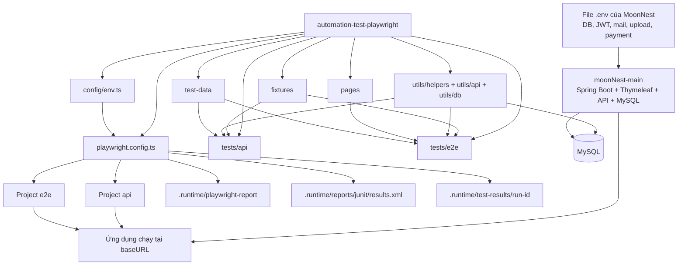

# CHƯƠNG 3. NGHIÊN CỨU VÀ ỨNG DỤNG KIỂM THỬ TỰ ĐỘNG BẰNG PLAYWRIGHT CHO HỆ THỐNG MOONNEST

## 3.1. Đối tượng kiểm thử

### 3.1.1. Giới thiệu đối tượng kiểm thử

Đối tượng kiểm thử được lựa chọn trong khóa luận là hệ thống web `moonNest-main`, một ứng dụng quản lý bất động sản được xây dựng theo kiến trúc web nhiều vai trò người dùng, kết hợp giữa giao diện dựng bằng Thymeleaf và các dịch vụ API dạng JSON. Đây là một hệ thống phù hợp cho nghiên cứu và ứng dụng kiểm thử tự động vì mang đầy đủ những đặc trưng thường gặp trong các hệ thống thông tin doanh nghiệp hiện đại: có cơ chế xác thực, phân quyền, thao tác CRUD phức tạp, xử lý nghiệp vụ theo vai trò người dùng, trao đổi dữ liệu với cơ sở dữ liệu quan hệ, và sử dụng kết hợp cả giao diện người dùng lẫn tầng dịch vụ.

Theo cấu trúc mã nguồn thực tế, dự án `moonNest-main` được phát triển bằng Java 21 trên nền Spring Boot 3.5.7. Hệ thống sử dụng Spring MVC kết hợp Thymeleaf để dựng trang, Spring Data JPA để thao tác dữ liệu, Spring Security với JWT cookie và OAuth2 để xác thực, MySQL làm cơ sở dữ liệu chính, và H2 cho môi trường kiểm thử tích hợp. Các thành phần này được thể hiện rõ trong tệp `pom.xml` cũng như `README.md` của dự án.

Từ góc nhìn kiểm thử, MoonNest không chỉ là một website trình bày thông tin bất động sản mà là một hệ thống quản trị nghiệp vụ hoàn chỉnh. Hệ thống cung cấp các chức năng cho bốn nhóm tác nhân chính:

1. Người dùng công khai truy cập trang giới thiệu và tra cứu bất động sản.
2. Khách hàng đăng nhập để theo dõi hợp đồng, hóa đơn, yêu cầu thuê hoặc mua, giao dịch thanh toán và hồ sơ cá nhân.
3. Nhân viên quản lý danh sách tòa nhà, khách hàng được phân công, hợp đồng, hóa đơn và hồ sơ cá nhân.
4. Quản trị viên quản lý toàn bộ dữ liệu hệ thống như tòa nhà, khách hàng, nhân viên, hợp đồng thuê, hợp đồng mua bán, hóa đơn, yêu cầu giao dịch và báo cáo tổng hợp.

### 3.1.2. Lý do lựa chọn MoonNest làm đối tượng kiểm thử

Việc lựa chọn MoonNest làm đối tượng kiểm thử xuất phát từ các nguyên nhân sau:

Thứ nhất, hệ thống có phạm vi nghiệp vụ rộng. Đây là điều kiện quan trọng để đánh giá khả năng áp dụng kiểm thử tự động trên nhiều lớp chức năng khác nhau, từ xác thực, quản lý hồ sơ người dùng, nghiệp vụ quản trị dữ liệu cho tới các luồng thanh toán.

Thứ hai, hệ thống có sự kết hợp giữa giao diện web và API nền. Điều này đặc biệt phù hợp với Playwright vì công cụ này không chỉ hỗ trợ kiểm thử giao diện đầu cuối mà còn hỗ trợ mạnh cho kiểm thử API, giúp xây dựng chiến lược kiểm thử đa lớp trong cùng một framework thống nhất.

Thứ ba, hệ thống có cơ chế phân quyền rõ ràng theo vai trò. Đây là điều kiện thuận lợi để xây dựng các bài toán kiểm thử về xác thực, phân quyền truy cập, cô lập dữ liệu theo vai trò, và kiểm tra tính đúng đắn của các chức năng nghiệp vụ.

Thứ tư, hệ thống có số lượng màn hình và endpoint đủ lớn để phản ánh được nhu cầu thực tế của một dự án phần mềm. Qua khảo sát cấu trúc mã nguồn, hệ thống hiện có:

- 24 lớp API controller trong thư mục `src/main/java/com/estate/api`.
- 60 giao diện HTML Thymeleaf trong thư mục `src/main/resources/templates`.
- Nhiều nhóm module nghiệp vụ như building, customer, staff, contract, sale contract, invoice, property request, profile, public browsing và payment.

Thứ năm, hệ thống có nhiều chức năng thay đổi dữ liệu và có mối quan hệ ràng buộc giữa các thực thể. Điều này tạo ra nhu cầu thực tế cho việc xây dựng các kỹ thuật tạo dữ liệu kiểm thử tạm thời, dọn dẹp dữ liệu sau test, và đối soát dữ liệu trực tiếp với cơ sở dữ liệu.

### 3.1.3. Đặc điểm kỹ thuật của đối tượng kiểm thử

Từ tài liệu và mã nguồn của dự án, có thể mô tả các đặc điểm kỹ thuật chính của MoonNest như sau:

- Nền tảng phát triển: Java 21, Spring Boot 3.5.7.
- Kiến trúc web: Spring MVC kết hợp Thymeleaf.
- Tầng dữ liệu: Spring Data JPA, MySQL.
- Tầng bảo mật: Spring Security, JWT cookie authentication, Google OAuth2.
- Tầng giao diện: HTML, CSS, JavaScript, Bootstrap, jQuery, AJAX.
- Tầng tích hợp phụ trợ: gửi mail, OTP, thanh toán QR.

Hệ thống cung cấp hai dạng điểm truy cập chính:

1. Các trang giao diện web, ví dụ:
   - `/moonnest`
   - `/login`
   - `/admin/dashboard`
   - `/staff/dashboard`
   - `/customer/home`
2. Các dịch vụ API, chủ yếu theo tiền tố `/api/v1/**`, ví dụ:
   - `/api/v1/auth/*`
   - `/api/v1/admin/*`
   - `/api/v1/staff/*`
   - `/api/v1/customer/*`
   - `/api/v1/profile/*`
   - `/api/v1/public/*`
   - `/payment-demo/*`

Từ đó có thể thấy MoonNest là một đối tượng kiểm thử điển hình cho nghiên cứu ứng dụng Playwright vì vừa có tính đại diện cho hệ thống web thực tế, vừa cho phép triển khai đồng thời kiểm thử giao diện và kiểm thử dịch vụ.

### 3.1.4. Phạm vi chức năng được đưa vào kiểm thử tự động

Dựa trên cấu trúc thực tế của dự án `automation-test-playwright`, phạm vi kiểm thử tự động đã được triển khai cho các nhóm chức năng sau:

- Xác thực và hỗ trợ tài khoản: đăng nhập, đăng ký, quên mật khẩu, đặt lại mật khẩu, duy trì phiên đăng nhập.
- Chức năng công khai: tra cứu bất động sản trên trang public.
- Chức năng quản trị viên:
  - quản lý tòa nhà,
  - quản lý thông tin bổ sung của tòa nhà,
  - quản lý khách hàng,
  - quản lý nhân viên,
  - quản lý hợp đồng thuê,
  - quản lý hợp đồng mua bán,
  - quản lý hóa đơn,
  - quản lý yêu cầu giao dịch,
  - quản lý hồ sơ cá nhân,
  - theo dõi dashboard và report.
- Chức năng nhân viên:
  - dashboard,
  - danh sách tòa nhà,
  - danh sách khách hàng,
  - danh sách hợp đồng,
  - danh sách hợp đồng mua bán,
  - danh sách hóa đơn,
  - hồ sơ cá nhân.
- Chức năng khách hàng:
  - trang chủ,
  - danh sách tòa nhà,
  - danh sách hợp đồng,
  - hóa đơn,
  - thanh toán QR,
  - lịch sử giao dịch,
  - yêu cầu thuê hoặc mua,
  - dịch vụ,
  - hồ sơ cá nhân.

Phạm vi trên cho thấy việc kiểm thử tự động không chỉ tập trung vào một module đơn lẻ mà đã được tổ chức ở mức hệ thống, đủ để làm cơ sở minh chứng cho tính khả thi của đề tài.

## 3.2. Các bài toán kiểm thử

### 3.2.1. Quan điểm xây dựng bài toán kiểm thử

Trong nghiên cứu này, các bài toán kiểm thử không được xây dựng theo hướng “có dự án rồi mới nghĩ xem nên test gì”, mà được xác định từ chính các vấn đề thường gặp trong một hệ thống web nghiệp vụ nhiều vai trò. Nói cách khác, framework `automation-test-playwright` được thiết kế để giải những bài toán kiểm thử có tính khái quát, sau đó được áp dụng vào đối tượng cụ thể là MoonNest.

Việc xác định bài toán theo hướng này có ý nghĩa quan trọng đối với khóa luận. Nó giúp luận văn không dừng ở mức mô tả thao tác sử dụng công cụ, mà thể hiện được tư duy nghiên cứu: từ vấn đề kiểm thử trong thực tiễn, xây dựng giải pháp bằng Playwright, rồi triển khai trên một hệ thống cụ thể.

### 3.2.2. Bài toán 1: Kiểm thử xác thực và quản lý phiên người dùng

MoonNest là hệ thống có nhiều vai trò người dùng và các chức năng nhạy cảm. Do đó, bài toán đầu tiên cần giải quyết là làm thế nào kiểm thử tự động được các luồng xác thực và quản lý phiên làm việc, bao gồm:

- đăng nhập đúng thông tin,
- từ chối đăng nhập sai,
- lấy thông tin người dùng hiện tại,
- đăng xuất và thu hồi phiên,
- quên mật khẩu,
- xác thực OTP trong một số luồng đặc biệt,
- duy trì trạng thái xác thực qua cookie giữa các request và giữa các bước trong hành trình người dùng.

Đây là bài toán nền tảng vì gần như mọi chức năng nghiệp vụ phía sau đều phụ thuộc vào trạng thái đăng nhập. Nếu không giải quyết tốt bài toán này, framework sẽ phải lặp lại thao tác đăng nhập trong từng test, gây khó bảo trì và khó mở rộng.

Trong dự án `automation-test-playwright`, bài toán này được giải bằng các thành phần như:

- `ApiSessionHelper` để tạo `APIRequestContext` đã đăng nhập theo role.
- `AuthHelper`, `AuthSessionHelper`, `PageScenarioHelper` để hỗ trợ luồng đăng nhập ở tầng giao diện.
- Các fixture dùng chung như `adminApi`, `staffApi`, `customerApi`, `anonymousApi`.
- Các bộ test `tests/api/auth/*` và `tests/e2e/auth/*`.

### 3.2.3. Bài toán 2: Kiểm thử phân quyền và cô lập chức năng theo vai trò

Với các hệ thống đa vai trò, không chỉ cần kiểm tra người dùng có đăng nhập được hay không, mà còn phải xác nhận rằng mỗi loại người dùng chỉ được thực hiện đúng những thao tác thuộc thẩm quyền của mình. Do đó, bài toán thứ hai là kiểm thử phân quyền truy cập và cô lập dữ liệu theo vai trò.

Bài toán này bao gồm các yêu cầu sau:

- người dùng chưa đăng nhập phải bị chặn khi truy cập endpoint bảo vệ;
- người dùng sai vai trò phải bị từ chối truy cập;
- người dùng đúng vai trò phải truy cập được chức năng tương ứng;
- dữ liệu trả về phải nằm trong đúng phạm vi của người dùng đó.

Ví dụ:

- Khách hàng không được gọi API quản trị viên.
- Nhân viên không được cập nhật dữ liệu thuộc quyền admin.
- Khách hàng chỉ được xem hóa đơn, hợp đồng và giao dịch của chính mình.
- Nhân viên chỉ được thao tác trên các khách hàng hoặc hợp đồng được phân công.

Trong framework hiện tại, bài toán này được giải thông qua:

- các bộ test `security.api.spec.ts`,
- các nhóm `readonly.api.spec.ts` cho staff và customer,
- cách tách context theo role trong `api.fixture.ts`,
- việc gắn tag kiểm thử như `@smoke`, `@regression`, `@api-read`, `@api-write`.

### 3.2.4. Bài toán 3: Kiểm thử nghiệp vụ CRUD có ràng buộc dữ liệu

Một trong những trọng tâm của MoonNest là quản trị dữ liệu nghiệp vụ. Các thực thể như tòa nhà, khách hàng, hợp đồng, nhân viên, hóa đơn hay hợp đồng mua bán đều có vòng đời dữ liệu rõ ràng: tạo mới, tra cứu, cập nhật, xóa hoặc khóa chỉnh sửa. Vì vậy, bài toán kiểm thử tiếp theo là kiểm tra đúng đắn của các luồng CRUD.

Bài toán này không đơn giản chỉ là “gửi request thành công” mà phải bao gồm:

- kiểm tra dữ liệu đầu vào hợp lệ và không hợp lệ;
- kiểm tra thông báo thành công hoặc thất bại;
- kiểm tra tính toàn vẹn dữ liệu sau khi lưu xuống cơ sở dữ liệu;
- kiểm tra các ràng buộc ngăn không cho cập nhật hoặc xóa khi dữ liệu đã liên kết với nghiệp vụ khác.

Ví dụ tiêu biểu từ dự án:

- Tòa nhà đang có hợp đồng hoạt động thì không được phép xóa.
- Tòa nhà đã bán thì không được sửa theo cách làm sai lệch trạng thái bán.
- Hồ sơ người dùng yêu cầu OTP hoặc mật khẩu hiện tại trước khi cập nhật.
- Hóa đơn phải gắn với hợp đồng hợp lệ.

Đây là bài toán cốt lõi để chứng minh giá trị của kiểm thử tự động trong môi trường doanh nghiệp, bởi lỗi nghiệp vụ thường phát sinh ở chính các ràng buộc dữ liệu này.

Trong `automation-test-playwright`, bài toán được giải bằng:

- API test để kiểm tra hợp đồng giao tiếp và mã phản hồi,
- E2E test để mô phỏng thao tác thực của người dùng,
- `TempEntityHelper` để tạo dữ liệu tạm thời có kiểm soát,
- `MySqlDbClient` để truy vấn xác minh dữ liệu,
- `TestDataCleanup` và `global-teardown.ts` để dọn dẹp dữ liệu sau khi test.

### 3.2.5. Bài toán 4: Kiểm thử luồng nghiệp vụ đầu cuối trên giao diện

Nếu chỉ kiểm tra API, chưa thể đảm bảo rằng người dùng thực sự thao tác được trên hệ thống. Vì vậy, một bài toán quan trọng khác là kiểm thử các hành trình người dùng đầu cuối trên giao diện web.

Bài toán này trả lời các câu hỏi:

- Người dùng có truy cập được màn hình đúng chức năng không?
- Các bộ lọc, biểu mẫu, nút thao tác có hoạt động đúng không?
- Sau thao tác, hệ thống có điều hướng, hiển thị thông báo và cập nhật giao diện phù hợp không?
- Hành trình nhiều bước có thực sự hoàn thành từ đầu tới cuối hay không?

Các nhóm bài toán giao diện đã được phản ánh rõ trong dự án như:

- admin building management,
- admin invoice management,
- admin staff management,
- auth login,
- auth registration,
- customer invoice payment,
- customer property request,
- public building browsing,
- staff invoice list,
- customer profile.

Đây là nhóm bài toán mà Playwright thể hiện ưu thế mạnh vì hỗ trợ thao tác trình duyệt thật, chờ đợi điều kiện động, ghi lại screenshot, video và trace khi lỗi.

### 3.2.6. Bài toán 5: Kiểm thử dữ liệu động và dữ liệu tạm thời

Trong các hệ thống có dữ liệu thay đổi liên tục, một bài toán lớn là làm sao để mỗi test độc lập, có khả năng chạy lặp lại và không làm hỏng dữ liệu nền. Nếu dùng dữ liệu cố định, test sẽ nhanh chóng trở nên mong manh khi dữ liệu thực tế thay đổi.

Do đó, framework cần giải quyết bài toán tạo dữ liệu tạm thời cho mỗi ca kiểm thử, ví dụ:

- tạo tòa nhà tạm,
- tạo nhân viên tạm,
- tạo khách hàng tạm,
- tạo hợp đồng tạm,
- tạo hóa đơn tạm,
- tạo yêu cầu mua hoặc thuê tạm.

Sau khi kết thúc, dữ liệu tạm cần được dọn dẹp an toàn để tránh gây ô nhiễm môi trường kiểm thử.

Trong dự án hiện tại, bài toán này được giải quyết qua:

- `TestDataFactory` để sinh dữ liệu động,
- `TempEntityHelper` để tạo và xóa dữ liệu qua API và DB,
- `cleanupRegistry` trong API fixture,
- `global-teardown.ts` để quét và dọn dữ liệu tồn dư theo tiền tố `PW`.

Đây là một điểm rất quan trọng để chứng minh framework không chỉ “chạy được test”, mà còn giải bài toán vận hành test trong môi trường thực tế.

### 3.2.7. Bài toán 6: Kiểm thử tải tệp và ràng buộc file upload

MoonNest có chức năng tải ảnh tòa nhà và ảnh sơ đồ quy hoạch. Vì vậy xuất hiện bài toán kiểm thử dữ liệu nhị phân và các ràng buộc file upload, bao gồm:

- từ chối định dạng không hợp lệ,
- từ chối file rỗng,
- kiểm tra phần mở rộng file,
- kiểm tra kích thước tối đa,
- kiểm tra cơ chế đặt tên file sau khi tải lên.

Trong dự án, bài toán này được xử lý ở các test như:

- upload ảnh building,
- upload planning map image,
- file fixture trong `test-data/files`,
- helper `ApiFileFixtures`.

Nhóm bài toán này có ý nghĩa thực tiễn vì lỗi upload file thường liên quan đến bảo mật, lưu trữ và kiểm soát tài nguyên.

### 3.2.8. Bài toán 7: Kiểm thử báo cáo kết quả và truy vết lỗi

Không dừng lại ở việc chạy test, nghiên cứu còn cần giải quyết bài toán quản lý kết quả kiểm thử sao cho:

- người phát triển có thể nhanh chóng biết test nào đỗ, test nào trượt;
- có đủ bằng chứng để phân tích nguyên nhân lỗi;
- kết quả có thể dùng trong báo cáo kỹ thuật hoặc tích hợp CI/CD.

Đây là lý do framework được cấu hình sinh nhiều loại báo cáo:

- báo cáo HTML,
- báo cáo JUnit XML,
- screenshot khi lỗi,
- video khi lỗi,
- trace ở lần retry đầu tiên.

Như vậy, bài toán “quản lý kết quả kiểm thử” đã được giải ngay từ khâu thiết kế framework, chứ không để đến khi hoàn thành mới xử lý bổ sung.

### 3.2.9. Tổng kết các bài toán kiểm thử

Từ các phân tích trên, có thể tổng hợp các bài toán kiểm thử trọng tâm mà đề tài cần giải quyết như sau:

| STT | Bài toán kiểm thử | Ý nghĩa đối với hệ thống |
| --- | --- | --- |
| 1 | Kiểm thử xác thực và phiên đăng nhập | Bảo đảm người dùng vào hệ thống đúng cách |
| 2 | Kiểm thử phân quyền theo vai trò | Ngăn truy cập sai quyền, bảo vệ dữ liệu |
| 3 | Kiểm thử CRUD nghiệp vụ | Bảo đảm tính đúng đắn của thao tác dữ liệu |
| 4 | Kiểm thử hành trình giao diện đầu cuối | Bảo đảm người dùng thao tác thực tế được |
| 5 | Kiểm thử dữ liệu tạm và độc lập test | Giúp test ổn định, lặp lại được |
| 6 | Kiểm thử upload file | Kiểm soát dữ liệu nhị phân và ràng buộc file |
| 7 | Kiểm thử báo cáo và truy vết lỗi | Phục vụ phân tích, bảo trì và tích hợp CI |

Các bài toán trên chính là cơ sở để hình thành dự án `automation-test-playwright`. Nói cách khác, framework là lời giải có cấu trúc cho một tập vấn đề kiểm thử cụ thể của hệ thống web MoonNest.

## 3.3. Cài đặt và cấu hình Playwright

### 3.3.1. Mục tiêu của quá trình cài đặt và cấu hình

Việc cài đặt Playwright trong khóa luận không chỉ mang ý nghĩa kỹ thuật đơn thuần, mà còn nhằm xây dựng một môi trường kiểm thử có thể tái sử dụng, mở rộng và vận hành ổn định. Vì vậy, quá trình cấu hình được thiết kế theo các nguyên tắc:

- tách biệt dự án kiểm thử khỏi dự án ứng dụng chính;
- hỗ trợ nhiều môi trường chạy;
- tách riêng kiểm thử API và kiểm thử E2E;
- quản lý tốt phiên đăng nhập, dữ liệu test và kết quả chạy;
- hạn chế ảnh hưởng lên dữ liệu thật.

Trong nghiên cứu này, mã nguồn kiểm thử được đặt tại dự án độc lập `automation-test-playwright`, tách biệt với dự án ứng dụng `moonNest-main`. Cách tổ chức này giúp framework có tính độc lập, dễ bảo trì và có thể mở rộng thành một bộ công cụ kiểm thử riêng.

### 3.3.2. Chuẩn bị môi trường

Để chạy được framework kiểm thử, cần chuẩn bị đồng thời môi trường cho cả hệ thống kiểm thử và hệ thống được kiểm thử.

#### a) Môi trường cho dự án MoonNest

Các thành phần cần có:

- Java 21.
- MySQL.
- Cơ sở dữ liệu MoonNest đã được tạo và nạp dữ liệu.
- File cấu hình môi trường `.env` cho ứng dụng.

Theo `README.md` của dự án, ứng dụng có thể chạy bằng lệnh:

```powershell
cd D:\Documents\1.1.KLTN_PLAYWRIGHT\moonNest-main
.\mvnw.cmd spring-boot:run
```

Nếu chạy môi trường cục bộ không dùng OAuth, có thể cấu hình:

```powershell
$env:SPRING_PROFILES_ACTIVE="mysql,local-nooauth"
.\mvnw.cmd spring-boot:run
```

#### b) Môi trường cho dự án Playwright

Các thành phần cần có:

- Node.js.
- npm.
- Trình duyệt do Playwright quản lý.
- Các gói phụ thuộc TypeScript và MySQL driver.

Trong `package.json`, framework sử dụng các gói chính:

- `@playwright/test`
- `typescript`
- `dotenv`
- `mysql2`
- `@types/node`

### 3.3.3. Cài đặt framework Playwright

Các bước cài đặt được thực hiện như sau:

**Bước 1. Di chuyển vào thư mục framework**

```powershell
cd D:\Documents\1.1.KLTN_PLAYWRIGHT\automation-test-playwright
```

**Bước 2. Cài đặt các phụ thuộc**

```powershell
npm install
```

Lệnh này đọc thông tin từ `package.json` và cài toàn bộ thư viện cần thiết cho framework.

**Bước 3. Cài trình duyệt cho Playwright**

```powershell
npx playwright install chromium
```

Trong dự án hiện tại, cấu hình E2E sử dụng thiết bị `Desktop Chrome`, do đó việc cài Chromium là cần thiết để thực thi test giao diện.

**Bước 4. Kiểm tra TypeScript**

```powershell
npm run typecheck
```

Lệnh này giúp phát hiện sai sót kiểu dữ liệu trước khi chạy test.

### 3.3.4. Cấu hình các script thực thi

Framework đã được cấu hình sẵn nhiều script trong `package.json`. Việc chia script thành nhiều nhóm có ý nghĩa quan trọng trong thực tế vận hành:

- `npm run test`: chạy toàn bộ test.
- `npm run test:api`: chạy toàn bộ API test.
- `npm run test:e2e`: chạy toàn bộ E2E test.
- `npm run test:smoke`: chạy nhóm smoke test.
- `npm run test:regression`: chạy nhóm hồi quy.
- `npm run test:ci`: phục vụ kiểm tra trong pipeline CI.
- `npm run report`: mở báo cáo HTML.
- `npm run codegen`: hỗ trợ sinh mã thao tác ban đầu từ Playwright.

Việc định nghĩa script như trên giúp quy trình thực thi trở nên chuẩn hóa, hạn chế việc người kiểm thử phải nhớ các lệnh dài và giảm nguy cơ chạy sai phạm vi test.

### 3.3.5. Cấu hình tệp `playwright.config.ts`

Tệp `playwright.config.ts` là trung tâm điều phối toàn bộ framework. Cấu hình trong dự án hiện tại có một số điểm đáng chú ý như sau:

#### a) Cấu hình thư mục test

```ts
testDir: "./tests"
```

Toàn bộ test được tổ chức dưới thư mục `tests`, sau đó chia tiếp thành `tests/api` và `tests/e2e`. Cách phân loại này thuận lợi cho việc quản lý và mở rộng.

#### b) Cấu hình `globalSetup` và `globalTeardown`

```ts
globalSetup: "./config/global-setup.ts",
globalTeardown: "./config/global-teardown.ts",
```

Đây là một lựa chọn kiến trúc quan trọng. Trước khi chạy, framework dọn dẹp và tạo mới các thư mục runtime. Sau khi chạy, framework quét dữ liệu test còn tồn dư và xóa các tệp upload tạm, từ đó giữ cho môi trường ổn định.

#### c) Cấu hình song song và retry

```ts
fullyParallel: true,
retries: env.retryPolicy.ui,
workers: process.env.CI ? 2 : env.workers,
```

Điều này cho phép framework tận dụng khả năng chạy song song của Playwright nhưng vẫn kiểm soát số lượng worker theo môi trường. Trong CI, số worker được giới hạn để giảm áp lực tài nguyên.

#### d) Cấu hình timeout

```ts
timeout: 60_000,
expect: {
  timeout: env.expectTimeout
}
```

Việc cấu hình timeout ở cả cấp test và cấp assertion giúp giảm tình trạng test treo vô thời hạn, đồng thời cho phép điều chỉnh linh hoạt từ file môi trường.

#### e) Cấu hình reporter

```ts
reporter: [
  ["html", { open: "never", outputFolder: runtimePaths.htmlReportDir }],
  ["list"],
  ["junit", { outputFile: runtimePaths.junitReportFile }]
]
```

Ba loại reporter này phục vụ ba mục tiêu khác nhau:

- `list` phục vụ quan sát nhanh trên console.
- `html` phục vụ phân tích thủ công và trình bày kết quả.
- `junit` phục vụ tích hợp CI/CD và tổng hợp số liệu.

#### f) Cấu hình mặc định cho mọi test

```ts
use: {
  baseURL: env.baseUrl,
  headless: true,
  trace: "on-first-retry",
  screenshot: "only-on-failure",
  video: "retain-on-failure",
  actionTimeout: env.actionTimeout,
  navigationTimeout: env.navigationTimeout
}
```

Đây là cấu hình rất phù hợp cho một framework nghiên cứu ứng dụng thực tế. Thay vì luôn chụp ảnh hay ghi video gây tốn dung lượng, framework chỉ giữ artefact khi có lỗi hoặc cần retry. Điều này cân bằng tốt giữa khả năng truy vết và chi phí lưu trữ.

#### g) Tách project API và E2E

Framework không dồn tất cả test vào một project duy nhất mà tách thành hai project:

- `e2e`: khớp với các file `tests/e2e/*.spec.ts`
- `api`: khớp với các file `*.api.spec.ts`

Việc tách project có tác dụng:

- áp dụng cấu hình chuyên biệt cho từng loại test,
- tắt screenshot/video/trace ở API test để tiết kiệm tài nguyên,
- giúp thống kê rõ ràng hơn khi chạy.

### 3.3.6. Cấu hình môi trường trong `config/env.ts`

Tệp `config/env.ts` đóng vai trò chuẩn hóa việc đọc cấu hình môi trường từ `.env`. Đây là thành phần rất quan trọng vì framework cần chạy được ở nhiều môi trường như:

- `local`
- `dev`
- `test`
- `staging`

Các biến được cấu hình bao gồm:

- `baseUrl`
- tài khoản admin, staff, customer
- mật khẩu mặc định
- timeout request, action, navigation, expect
- số worker
- retry policy
- token OTP support
- thông tin kết nối cơ sở dữ liệu

Điểm đáng chú ý là dự án cho phép cấu hình URL theo từng môi trường. Điều này cho phép cùng một bộ test có thể tái sử dụng khi triển khai trên nhiều môi trường chạy khác nhau.

### 3.3.7. Cấu hình đường dẫn runtime trong `config/paths.ts`

Tệp `config/paths.ts` quy định nơi lưu trữ toàn bộ kết quả chạy:

- `.runtime/playwright-report`
- `.runtime/reports/junit/results.xml`
- `.runtime/test-results/<run-id>`

Thiết kế này giúp tách hoàn toàn dữ liệu chạy test ra khỏi mã nguồn. Nhờ đó:

- workspace sạch hơn,
- dễ xoá hoặc lưu trữ theo lần chạy,
- tiện trích xuất bằng chứng kiểm thử cho báo cáo.

### 3.3.8. Cấu hình khởi tạo và dọn dẹp trước sau khi chạy

#### a) `global-setup.ts`

Trong giai đoạn thiết lập ban đầu, framework thực hiện các công việc:

- xóa HTML report và JUnit report cũ,
- tạo lại các thư mục runtime,
- giữ cho chỉ một số lần chạy gần nhất được lưu trong `.runtime/test-results`.

Đây là một cơ chế hữu ích vì nếu không có bước này, dự án sẽ nhanh chóng phình to bởi các artifact cũ.

#### b) `global-teardown.ts`

Sau khi chạy, framework thực hiện quét:

- các file ảnh upload tạm của building,
- các file ảnh upload tạm của planning map,
- các bản ghi building, customer, staff, email verification được tạo bởi test.

Tiêu chí quét dựa trên tiền tố dữ liệu sinh bởi framework như `PW Building`, `pwcust`, `pw-...@example.com`. Đây là cách tiếp cận an toàn vì giúp phân biệt dữ liệu test với dữ liệu nghiệp vụ thật.

### 3.3.9. Cấu hình fixture dùng chung

Framework xây dựng hai fixture chính:

#### a) `base.fixture.ts`

Phục vụ chủ yếu cho E2E test, cung cấp:

- `adminApi`
- `loginPage`
- `publicPage`
- `customerInvoicePage`

#### b) `api.fixture.ts`

Phục vụ API test, cung cấp:

- `adminApi`
- `staffApi`
- `customerApi`
- `anonymousApi`
- `cleanupRegistry`

Việc đưa các context đăng nhập vào fixture có tác dụng cực kỳ quan trọng:

- giảm lặp lại mã,
- thống nhất cách khởi tạo phiên,
- giúp test chỉ tập trung vào logic kiểm tra,
- dễ bảo trì khi cơ chế xác thực thay đổi.

### 3.3.10. Cấu hình kết nối cơ sở dữ liệu

Khác với nhiều framework kiểm thử chỉ dừng ở kiểm tra response, framework trong khóa luận có kết nối trực tiếp đến cơ sở dữ liệu MySQL thông qua `mysql2/promise`. Lớp `MySqlDbClient.ts` đọc cấu hình JDBC URL từ môi trường và tạo connection pool dùng chung.

Việc này phục vụ ba mục tiêu:

- xác minh dữ liệu sau thao tác API hoặc E2E,
- hỗ trợ tìm kiếm ID của thực thể vừa tạo,
- phục vụ dọn dẹp dữ liệu test.

Tuy nhiên, cách tiếp cận này cũng đòi hỏi kiểm soát chặt để tránh phụ thuộc quá sâu vào chi tiết cài đặt. Vì vậy trong framework hiện tại, DB verification chỉ được dùng khi nó thực sự tăng giá trị xác minh.

### 3.3.11. Cấu hình chế độ an toàn dữ liệu

Một điểm rất đáng chú ý của framework là có tư duy vận hành an toàn dữ liệu. Theo tài liệu `README.md` và `docs/huong-dan-framework.md`, framework mặc định không khuyến khích chạy các test có khả năng phá dữ liệu trên môi trường thật.

Khi cần chạy nhóm test có khả năng ghi hoặc xóa dữ liệu, người dùng phải chủ động bật biến:

```powershell
$env:ALLOW_DESTRUCTIVE_TESTS="true"
```

Thiết kế này cho thấy framework đã được xây dựng theo định hướng thực tế, không chỉ quan tâm việc “test chạy được” mà còn quan tâm đến rủi ro vận hành.

### 3.3.12. Quy trình cài đặt và cấu hình tổng thể

Từ các phân tích trên, có thể mô tả quy trình cài đặt và cấu hình Playwright cho đề tài như sau:

1. Chuẩn bị dự án `moonNest-main` và cơ sở dữ liệu.
2. Cấu hình `.env` cho ứng dụng web.
3. Khởi động ứng dụng MoonNest tại địa chỉ chạy thử.
4. Cài đặt các gói Node.js cho dự án `automation-test-playwright`.
5. Cài đặt trình duyệt Chromium cho Playwright.
6. Tạo và điều chỉnh file `.env` của dự án kiểm thử.
7. Cấu hình `playwright.config.ts`, `env.ts`, `paths.ts`.
8. Thiết lập fixture, session helper, DB helper và cơ chế cleanup.
9. Chạy `typecheck` để xác nhận framework hợp lệ.
10. Thực thi test và sinh báo cáo.

### 3.3.13. Sơ đồ cấu hình sau khi hoàn tất

Sơ đồ sau mô tả mối liên hệ giữa dự án được kiểm thử, framework Playwright, môi trường cấu hình và đầu ra báo cáo sau khi hoàn tất cấu hình:



Sơ đồ trên cho thấy framework được tổ chức theo mô hình nhiều lớp: lớp cấu hình, lớp dùng lại, lớp kiểm thử và lớp báo cáo. Điều này phù hợp với mục tiêu xây dựng một hệ thống kiểm thử tự động có khả năng mở rộng và vận hành trong dài hạn.

## 3.4. Phân tích và thiết kế test case

### 3.4.1. Mục tiêu của việc phân tích và thiết kế test case

Sau khi xác định đối tượng kiểm thử, bài toán kiểm thử và hoàn thành cấu hình môi trường, bước tiếp theo là phân tích và thiết kế test case. Mục tiêu của giai đoạn này không chỉ là liệt kê các trường hợp cần test, mà còn phải xây dựng được một cấu trúc tổ chức test hợp lý, giúp:

- dễ đọc,
- dễ tìm kiếm,
- dễ tái sử dụng,
- dễ mở rộng theo module nghiệp vụ,
- dễ bảo trì khi hệ thống thay đổi.

Trong dự án `automation-test-playwright`, test case được thiết kế theo hướng framework hóa, nghĩa là không viết test một cách rời rạc mà tổ chức thành các tầng riêng biệt.

### 3.4.2. Nguyên tắc thiết kế test case trong đề tài

Các test case được xây dựng dựa trên một số nguyên tắc sau:

1. Mỗi test case phải gắn với một mục tiêu kiểm tra cụ thể.
2. Tên test phải phản ánh được vai trò, module, hành vi và kỳ vọng.
3. Test case được tách biệt dữ liệu, thao tác UI và logic assert.
4. Các thành phần dùng lại phải được đưa vào helper, fixture hoặc page object.
5. Với chức năng phức tạp, cần kết hợp xác minh ở nhiều lớp: response, giao diện và cơ sở dữ liệu.

Nhờ các nguyên tắc này, framework tránh được tình trạng test dài, khó đọc, khó sửa và lặp mã quá nhiều.

### 3.4.3. Tổ chức thư mục kiểm thử

Cấu trúc hiện tại của dự án kiểm thử được tổ chức như sau:

```text
automation-test-playwright/
|-- config/
|-- docs/
|-- fixtures/
|-- pages/
|-- test-data/
|-- tests/
|   |-- api/
|   `-- e2e/
`-- utils/
```

Mỗi nhóm thư mục mang một vai trò riêng trong thiết kế test case.

#### a) Thư mục `tests/`

Đây là nơi chứa test case thực sự. Dự án chia thành:

- `tests/api`: chứa API test.
- `tests/e2e`: chứa E2E test.

Trong cấu trúc thực tế, framework hiện có:

- 20 file spec API,
- 30 file spec E2E.

Việc chia tách này tạo ra ranh giới rõ ràng giữa kiểm thử dịch vụ và kiểm thử hành trình giao diện.

#### b) Thư mục `pages/`

Thư mục `pages/` chứa các lớp Page Object Model. Đây là tầng trừu tượng hóa giao diện, giúp test không phải chứa trực tiếp locator hoặc thao tác UI lặp lại. Dự án hiện có 62 tệp page object, chia theo module:

- `pages/admin`
- `pages/auth`
- `pages/customer`
- `pages/public`
- `pages/staff`
- `pages/core`

Trong đó, `pages/core` đóng vai trò lớp nền, cung cấp các abstraction như:

- `BasePage`
- `RoutedPage`
- `CrudListPage`
- `CrudFormPage`
- `CrudDetailPage`
- `AdminShellPage`
- `CustomerShellPage`
- `StaffShellPage`

Nhờ đó, các page object nghiệp vụ phía trên có thể kế thừa và tái sử dụng hành vi chung.

#### c) Thư mục `fixtures/`

Đây là nơi định nghĩa fixture dùng chung cho toàn framework. Thay vì khởi tạo request context hay page object trong từng file test, framework inject sẵn những tài nguyên thường dùng. Điều này giúp tăng tính nhất quán và giảm khối lượng mã lặp.

#### d) Thư mục `utils/`

Thư mục này chứa các thành phần hỗ trợ như:

- `utils/helpers`: helper tổng quát,
- `utils/api`: helper cho API,
- `utils/db`: helper cho cơ sở dữ liệu.

Đây là tầng kỹ thuật hỗ trợ cho test case, nhưng không phải là test case.

#### e) Thư mục `test-data/`

Đây là nơi lưu dữ liệu mẫu và các kịch bản bootstrap dữ liệu dùng chung. Trong khóa luận, đây là thành phần rất quan trọng vì nó thể hiện tư duy tách dữ liệu khỏi test logic.

Ví dụ:

- file mẫu upload trong `test-data/files`,
- dữ liệu tạm cho profile,
- kịch bản property request,
- dữ liệu tạm cho invoice.

### 3.4.4. Chiến lược thiết kế test case theo lớp

Để framework có tính ổn định và mở rộng tốt, test case được thiết kế theo mô hình nhiều lớp:

1. Lớp test case: mô tả hành vi cần kiểm tra.
2. Lớp page object hoặc API helper: mô tả cách tương tác.
3. Lớp test data: cung cấp dữ liệu đầu vào.
4. Lớp utility và DB helper: hỗ trợ xác minh và dọn dẹp.

Mô hình này có thể mô tả đơn giản như sau:

```text
Test case -> Fixture -> Page/API Helper -> Application -> DB verification -> Cleanup
```

Nhờ vậy, mỗi lớp chỉ chịu trách nhiệm cho một phần công việc rõ ràng.

### 3.4.5. Quy tắc đặt tên test case

Một ưu điểm nổi bật của framework là quy tắc đặt tên test khá chặt chẽ. Ví dụ:

- `[E2E-ADM-BLD-001] - Admin Building Management - Building Search - Filter and Detail View`
- `[BLD-004] - API Admin Building - Create Building - Successful Creation and Database Persistence`
- `[API-PAY-004] - API Payment - QR Payment - Customer-Owned Invoice HTML Rendering`

Cách đặt tên này có các lợi ích:

- dễ truy vết từ báo cáo về file test,
- dễ nhóm theo module,
- hỗ trợ viết luận văn vì mỗi test đã mang cấu trúc mô tả rõ ràng,
- thuận tiện khi tham chiếu trong kiểm thử hồi quy.

Tên test thường bao gồm các thành phần:

- mã test,
- loại test,
- vai trò hoặc module,
- hành vi được kiểm tra,
- kỳ vọng chính.

### 3.4.6. Thiết kế test case API

API test trong framework được dùng để kiểm tra các hợp đồng giao tiếp giữa frontend và backend. Một test API điển hình gồm các phần:

1. Chuẩn bị request context đúng vai trò.
2. Chuẩn bị dữ liệu đầu vào.
3. Gọi endpoint.
4. Kiểm tra mã trạng thái.
5. Kiểm tra cấu trúc hoặc nội dung response.
6. Nếu cần, xác minh thêm ở cơ sở dữ liệu.
7. Dọn dẹp dữ liệu tạm.

Ví dụ với module quản lý tòa nhà của admin, test API đã bao phủ các nhóm tình huống:

- truy cập không đăng nhập,
- thiếu trường bắt buộc,
- sai kiểu dữ liệu nghiệp vụ,
- phân trang và lọc dữ liệu,
- tạo mới thành công,
- cập nhật thành công,
- xóa thành công,
- khóa xóa hoặc khóa sửa khi có ràng buộc hợp đồng,
- tải file ảnh.

Có thể thấy test API không chỉ bao phủ luồng thành công mà còn bao phủ sâu các luồng lỗi và ràng buộc biên.

### 3.4.7. Thiết kế test case E2E

E2E test được dùng để kiểm tra luồng tương tác thực của người dùng. Một test E2E trong framework hiện tại thường có cấu trúc:

1. Tạo dữ liệu tạm qua API nếu cần.
2. Đăng nhập bằng tài khoản tương ứng.
3. Điều hướng tới màn hình cần kiểm tra.
4. Thao tác trên form, bảng dữ liệu hoặc popup.
5. Kiểm tra phản hồi trên UI.
6. Nếu cần, đối soát lại dữ liệu trong DB.
7. Dọn dẹp dữ liệu phát sinh.

Ví dụ test `admin-building-management.e2e.spec.ts` thể hiện rõ cách thiết kế này qua các tình huống:

- tìm kiếm và xem chi tiết tòa nhà,
- tạo mới tòa nhà cho thuê,
- cập nhật tòa nhà chưa bị khóa,
- hiển thị banner khóa chỉnh sửa khi có hợp đồng,
- xóa tòa nhà từ danh sách.

Điều quan trọng là phần thao tác UI được đóng gói vào page object, còn test giữ vai trò mô tả nghiệp vụ.

### 3.4.8. Thiết kế Page Object Model

Page Object Model là một trong những trụ cột quan trọng nhất của framework. Trong nghiên cứu này, POM được thiết kế theo các nguyên tắc:

- một page object đại diện cho một màn hình hoặc một khu vực chức năng rõ ràng;
- locator được khai báo tập trung trong class;
- method mô tả thao tác giao diện, không nhúng logic nghiệp vụ phức tạp;
- test không nên thao tác locator trực tiếp nếu page object đã tồn tại.

Ví dụ `AdminBuildingListPage` cung cấp các method:

- `expectLoaded()`
- `filterByName()`
- `filterByPropertyType()`
- `filterByTransactionType()`
- `search()`
- `rowByBuildingName()`
- `openDetail()`
- `openEdit()`
- `openAdditionalInformation()`
- `deleteBuilding()`
- `confirmSweetAlert()`

Nhờ vậy, test E2E chỉ cần gọi:

```ts
await listPage.filterByName(tempBuilding.name);
await listPage.search();
await listPage.openDetail(tempBuilding.name);
```

Thay vì phải chứa chi tiết selector trong file test.

### 3.4.9. Thiết kế dữ liệu kiểm thử

Dữ liệu kiểm thử được tổ chức thành hai nhóm:

#### a) Dữ liệu tĩnh

Bao gồm các file mẫu, đặc biệt là file upload:

- ảnh đúng định dạng,
- ảnh hỏng,
- tệp không phải ảnh.

Các dữ liệu này được lưu tại `test-data/files`.

#### b) Dữ liệu động

Bao gồm dữ liệu được sinh trong quá trình test như:

- tên tòa nhà,
- mã số thuế,
- username,
- email,
- yêu cầu thuê hoặc mua,
- hóa đơn,
- hợp đồng.

Nhóm dữ liệu này được sinh thông qua `TestDataFactory` hoặc các helper khác.

Chiến lược dữ liệu động rất phù hợp với kiểm thử tự động thực tế vì giúp:

- tránh trùng dữ liệu,
- tăng khả năng chạy lặp,
- giảm phụ thuộc vào trạng thái sẵn có của hệ thống.

### 3.4.10. Thiết kế cơ chế dữ liệu tạm và cleanup

Một thách thức lớn của kiểm thử tự động là bảo đảm tính độc lập giữa các test. Framework giải quyết điều này bằng cơ chế tạo thực thể tạm thời trong `TempEntityHelper` như:

- `taoStaffTam()`
- `taoCustomerTam()`
- `taoBuildingTam()`
- `taoContractTam()`
- `taoInvoiceTam()`
- `taoSaleContractTam()`
- `taoPropertyRequestTam()`

Sau khi hoàn thành, framework hỗ trợ xóa tương ứng:

- `xoaStaffTam()`
- `xoaCustomerTam()`
- `xoaBuildingTam()`
- `xoaContractTam()`
- `xoaInvoiceTam()`
- `xoaSaleContractTam()`
- `xoaPropertyRequestTam()`

Thiết kế này cho phép test case độc lập với nhau và giảm nguy cơ để lại dữ liệu rác.

### 3.4.11. Thiết kế mức độ bao phủ test

Từ tài liệu `api-coverage-matrix.md`, có thể thấy test case không được viết ngẫu nhiên mà được định hướng theo mức ưu tiên:

- P0 cho các luồng nền tảng như auth và public.
- P1 cho admin, staff, customer.
- P2 cho payment.

Đồng thời, các test được gắn theo tier:

- smoke baseline,
- core regression focus,
- extended focus.

Đây là cách thiết kế rất phù hợp với thực tiễn kiểm thử phần mềm vì không phải mọi test đều có giá trị vận hành như nhau.

### 3.4.12. Ví dụ phân tích và thiết kế một test case cụ thể

Có thể trình bày một test case điển hình như sau:

**Mã test:** `E2E-ADM-BLD-002`

**Tên test:** Admin Building Management - Building Creation - Rental Building Creation

**Mục tiêu:** Kiểm tra quản trị viên có thể tạo mới tòa nhà cho thuê từ giao diện.

**Tiền điều kiện:**

- Hệ thống đang chạy ổn định.
- Người dùng admin tồn tại và đăng nhập được.

**Dữ liệu đầu vào:**

- tên tòa nhà sinh động,
- quận, phường, đường,
- số tầng,
- diện tích sàn,
- loại giao dịch `FOR_RENT`,
- thông tin giá thuê và diện tích thuê.

**Các bước thực hiện:**

1. Truy cập trang danh sách tòa nhà.
2. Mở form thêm mới.
3. Chọn loại giao dịch cho thuê.
4. Điền thông tin chung.
5. Điền thông tin cho thuê.
6. Thiết lập tọa độ.
7. Gửi form.

**Kết quả mong đợi:**

- hệ thống hiển thị thông báo thành công,
- bản ghi building được tạo trong cơ sở dữ liệu,
- các trường dữ liệu chính lưu đúng giá trị.

**Dữ liệu xác minh bổ sung:**

- `transaction_type = FOR_RENT`
- `floor_area = 450`
- `tax_code` đúng theo dữ liệu phát sinh.

Ví dụ này cho thấy test case được thiết kế có đầy đủ mục tiêu, bước thực hiện, dữ liệu, kết quả mong đợi và cơ chế xác minh sâu.

### 3.4.13. Đánh giá cách tổ chức test case của framework

Từ góc nhìn kỹ thuật và góc nhìn luận văn, cách tổ chức test trong `automation-test-playwright` có thể được đánh giá là hợp lý vì:

- tách riêng các tầng trách nhiệm,
- dễ mở rộng theo module mới,
- thuận lợi cho kiểm thử hồi quy,
- có khả năng tái sử dụng cao,
- thể hiện rõ tư duy kỹ nghệ phần mềm thay vì chỉ viết test theo tình huống.

Đây cũng là một trong những đóng góp thực tiễn của đề tài: không chỉ minh họa dùng Playwright để test, mà còn đề xuất được một cách tổ chức framework có thể áp dụng cho các dự án web nghiệp vụ tương tự.

## 3.5. Thực thi và quản lý kết quả test

### 3.5.1. Mục tiêu của giai đoạn thực thi

Sau khi đã thiết kế hệ thống test case, giai đoạn thực thi nhằm mục đích:

- kiểm tra mức độ hoạt động thực tế của framework,
- đánh giá độ bao phủ chức năng,
- phát hiện lỗi hoặc hành vi chưa phù hợp của hệ thống,
- thu thập bằng chứng kiểm thử để phục vụ phân tích và báo cáo.

Trong đề tài này, việc thực thi không chỉ dừng ở thao tác chạy lệnh, mà còn gắn với cơ chế quản lý phiên test, quản lý dữ liệu phát sinh và quản lý báo cáo đầu ra.

### 3.5.2. Các hình thức chạy test trong framework

Framework hỗ trợ nhiều hình thức thực thi tương ứng với mục tiêu sử dụng khác nhau.

#### a) Chạy toàn bộ test

```powershell
npm run test
```

Phù hợp khi cần đánh giá tổng thể hệ thống hoặc thực hiện kiểm thử hồi quy diện rộng.

#### b) Chạy riêng API test

```powershell
npm run test:api
```

Phù hợp khi cần kiểm tra nhanh tính ổn định của backend và hợp đồng API.

#### c) Chạy riêng E2E test

```powershell
npm run test:e2e
```

Phù hợp khi cần kiểm tra các hành trình người dùng trên giao diện.

#### d) Chạy smoke test

```powershell
npm run test:smoke
```

Phù hợp cho kiểm tra nhanh các luồng quan trọng nhất trước khi demo, bàn giao hoặc triển khai.

#### e) Chạy regression test

```powershell
npm run test:regression
```

Phù hợp để đánh giá tính ổn định sau thay đổi mã nguồn.

#### f) Chạy theo nhóm chuyên biệt

Ví dụ:

```powershell
npm run test:api:admin
npm run test:api:customer
npm run test:api:payment
```

Nhờ vậy, người kiểm thử có thể lựa chọn phạm vi chạy đúng với mục tiêu phân tích.

### 3.5.3. Quy trình thực thi đề xuất

Trong bối cảnh vận hành thực tế, quy trình chạy test nên được thực hiện theo thứ tự:

1. Khởi động ứng dụng MoonNest.
2. Kiểm tra `BASE_URL` và các biến môi trường của framework.
3. Chạy `npm run typecheck`.
4. Chạy `npm run test:smoke`.
5. Nếu ổn định, chạy `npm run test:regression` hoặc `npm run test`.
6. Mở báo cáo HTML để phân tích lỗi.
7. Đối chiếu JUnit XML khi cần tổng hợp số liệu.

Quy trình này giúp tiết kiệm thời gian hơn so với việc luôn chạy toàn bộ test ngay từ đầu.

### 3.5.4. Quản lý phiên thực thi và dữ liệu test

Trong quá trình thực thi, framework sử dụng `ApiSessionHelper` để tạo các context đăng nhập theo role. Điều này mang lại các lợi ích:

- tránh lặp lại thao tác login ở từng test,
- bảo đảm mỗi nhóm test dùng đúng quyền truy cập,
- dễ tái sử dụng khi backend thay đổi cơ chế cookie hoặc session.

Song song đó, framework dùng `TempEntityHelper` để tạo dữ liệu phát sinh. Điều này đặc biệt quan trọng trong các test mutation như:

- tạo building,
- tạo contract,
- tạo invoice,
- tạo property request.

Sau test, dữ liệu sẽ được cleanup thông qua:

- cleanup cục bộ trong `afterEach` hoặc `afterAll`,
- `cleanupRegistry`,
- `global-teardown.ts`.

Nhờ vậy, framework có khả năng chạy lặp mà không làm môi trường ngày càng bẩn.

### 3.5.5. Các loại kết quả đầu ra sau khi chạy test

Framework sinh ra nhiều loại kết quả để phục vụ các mục tiêu khác nhau.

#### a) Kết quả trên console

Reporter `list` giúp hiển thị nhanh test nào chạy, test nào pass hoặc fail. Đây là dạng phản hồi nhanh nhất cho người thực thi.

#### b) Báo cáo HTML

Được lưu tại:

```text
.runtime/playwright-report/
```

Báo cáo HTML cho phép:

- xem tổng quan số test pass/fail,
- mở từng test để xem chi tiết,
- truy cập screenshot, video, trace đính kèm,
- phân tích theo file, theo suite, theo lỗi.

#### c) Báo cáo JUnit XML

Được lưu tại:

```text
.runtime/reports/junit/results.xml
```

Đây là định dạng rất hữu ích cho:

- tích hợp với CI/CD,
- tổng hợp thống kê bằng công cụ ngoài,
- trích số liệu đưa vào luận văn.

#### d) Artifact khi lỗi

Được lưu tại:

```text
.runtime/test-results/<run-id>/
```

Tùy cấu hình và trạng thái test, thư mục này có thể chứa:

- screenshot,
- video,
- error-context,
- trace.

### 3.5.6. Kết quả thực thi minh họa từ dữ liệu thực tế

Dựa trên tệp `results.xml` hiện có trong dự án, một lần thực thi gần đây của framework ghi nhận:

- Tổng số test đã chạy: 597.
- Số test thất bại: 23.
- Số test bị bỏ qua: 0.
- Tổng thời gian thực thi: khoảng 1033.53 giây.

Kết quả này cho thấy framework đã được triển khai ở quy mô tương đối lớn, chứ không chỉ dừng ở một vài test minh họa.

### 3.5.7. Phân tích một số kết quả chạy tiêu biểu

#### a) Nhóm test thành công

Nhiều module đạt kết quả tốt, ví dụ:

- `api/customer/customer-profile.api.spec.ts`: 10 test, 0 lỗi.
- `api/customer/customer-property-request.api.spec.ts`: 5 test, 0 lỗi.
- `api/staff/staff-invoice.api.spec.ts`: 6 test, 0 lỗi.
- `api/staff/staff-profile.api.spec.ts`: 10 test, 0 lỗi.
- `api/staff/staff-readonly.api.spec.ts`: 20 test, 0 lỗi.

Điều này cho thấy framework đã bao phủ ổn định một số khu vực nghiệp vụ cốt lõi.

#### b) Nhóm test phát hiện lỗi giao diện

Ví dụ ở `e2e/admin/admin-building-management.e2e.spec.ts`, có 5 test thì 3 test thất bại. Nguyên nhân không phải do không thực hiện được thao tác nghiệp vụ, mà do bước assert text thông báo SweetAlert bị lệch mã hóa tiếng Việt trong nội dung DOM. Đây là minh chứng rất rõ cho giá trị của kiểm thử tự động: không chỉ phát hiện lỗi “không chạy được chức năng”, mà còn phát hiện cả vấn đề chất lượng hiển thị và đồng nhất thông điệp.

#### c) Nhóm test phát hiện lỗi backend

Ví dụ ở `api/public/public.api.spec.ts`, test kiểm tra giá trị `propertyType` không hợp lệ kỳ vọng hệ thống trả về kết quả rỗng với HTTP 200, nhưng thực tế nhận được HTTP 500. Đây là lỗi mang tính chất hợp đồng API và xử lý dữ liệu đầu vào, rất phù hợp để đưa vào phần đánh giá hiệu quả của kiểm thử tự động trong luận văn.

### 3.5.8. Ví dụ minh họa cách đọc kết quả lỗi

Khi một test thất bại, framework cung cấp nhiều lớp thông tin:

1. Tên test đầy đủ.
2. File test và dòng lỗi.
3. Loại assertion bị fail.
4. Ảnh chụp màn hình lúc lỗi.
5. Video tái hiện hành vi.
6. File `error-context.md`.

Ví dụ, một lỗi trong test tạo building E2E cho biết:

- vị trí lỗi nằm ở bước `expectSweetAlertContains`,
- popup thực tế có hiển thị thành công nhưng chuỗi tiếng Việt bị lỗi mã hóa,
- screenshot và video đều được lưu kèm.

Như vậy, việc phân tích lỗi không còn phụ thuộc vào phán đoán cảm tính, mà có đầy đủ bằng chứng trực quan.

### 3.5.9. Quản lý kết quả test theo mục tiêu sử dụng

Tùy mục tiêu, kết quả test có thể được dùng theo các cách khác nhau:

#### a) Mục tiêu kỹ thuật

- xác định module lỗi,
- xác định bước lỗi,
- truy nguyên dữ liệu đầu vào gây lỗi,
- hỗ trợ sửa lỗi nhanh.

#### b) Mục tiêu quản lý chất lượng

- thống kê số test pass/fail,
- theo dõi mức độ ổn định giữa các lần chạy,
- xác định khu vực nhiều lỗi nhất.

#### c) Mục tiêu nghiên cứu và báo cáo luận văn

- minh chứng khả năng áp dụng Playwright trên hệ thống thực tế,
- chứng minh framework đã phát hiện được lỗi thật,
- đánh giá hiệu quả của kiểm thử API kết hợp E2E,
- làm cơ sở đề xuất hướng cải tiến cho hệ thống.

### 3.5.10. Ý nghĩa của việc quản lý kết quả test trong đề tài

Nếu chỉ dừng ở thao tác chạy test, đề tài sẽ mới thể hiện khía cạnh công cụ. Tuy nhiên, việc tổ chức và quản lý kết quả một cách bài bản giúp đề tài đạt tới giá trị ứng dụng thực tế hơn. Cụ thể:

- kết quả kiểm thử trở thành bằng chứng định lượng,
- lỗi được truy vết rõ ràng,
- có thể tái phân tích sau này,
- có thể mở rộng tích hợp vào quy trình DevOps hoặc CI/CD.

Đây là lý do phần quản lý kết quả test cần được xem như một nội dung độc lập quan trọng trong chương triển khai.

### 3.5.11. Nhận xét tổng quát về thực thi framework

Từ việc khảo sát framework và kết quả chạy thực tế, có thể rút ra một số nhận xét:

1. Framework đã đạt mức hoàn chỉnh tương đối cao, đủ khả năng vận hành ở quy mô hệ thống.
2. Việc kết hợp API test và E2E test giúp nâng cao độ tin cậy của kết quả kiểm thử.
3. Cơ chế tạo dữ liệu tạm và cleanup là điểm mạnh đáng chú ý.
4. Hệ thống báo cáo nhiều lớp giúp việc phân tích lỗi trở nên rõ ràng.
5. Kết quả thực thi đã ghi nhận được cả lỗi giao diện lẫn lỗi backend, cho thấy giá trị thực tiễn của đề tài.

## Kết luận chương

Trong chương này, khóa luận đã trình bày việc nghiên cứu và ứng dụng kiểm thử tự động bằng Playwright trên đối tượng kiểm thử là hệ thống web MoonNest. Nội dung triển khai được xây dựng theo một tiến trình logic gồm bốn bước chính: xác định đối tượng kiểm thử, xác định các bài toán kiểm thử cần giải, cài đặt và cấu hình framework Playwright, phân tích thiết kế test case, cuối cùng là thực thi và quản lý kết quả kiểm thử.

Kết quả khảo sát cho thấy MoonNest là một đối tượng phù hợp cho nghiên cứu vì có phạm vi nghiệp vụ rộng, đa vai trò người dùng, nhiều chức năng CRUD, nhiều điểm tích hợp API và yêu cầu phân quyền phức tạp. Trên cơ sở đó, dự án `automation-test-playwright` đã được tổ chức như một framework kiểm thử độc lập, có khả năng bao phủ đồng thời hai lớp kiểm thử quan trọng là API test và E2E test.

Đặc biệt, framework không chỉ giải quyết bài toán chạy test đơn lẻ, mà còn xử lý được các vấn đề thực tế như quản lý phiên đăng nhập, sinh dữ liệu kiểm thử động, dọn dẹp dữ liệu sau test, đối soát dữ liệu với cơ sở dữ liệu và quản lý báo cáo nhiều lớp. Đây là những yếu tố thể hiện rõ tính ứng dụng của đề tài trong môi trường phát triển phần mềm thực tế.

Nhìn chung, các kết quả thu được là cơ sở để khẳng định rằng Playwright có thể được ứng dụng hiệu quả trong kiểm thử tự động cho các hệ thống web nghiệp vụ nhiều vai trò như MoonNest. Đồng thời, framework được xây dựng trong đề tài cũng có thể xem là một mô hình tham khảo để mở rộng cho các hệ thống cùng đặc trưng trong tương lai.
