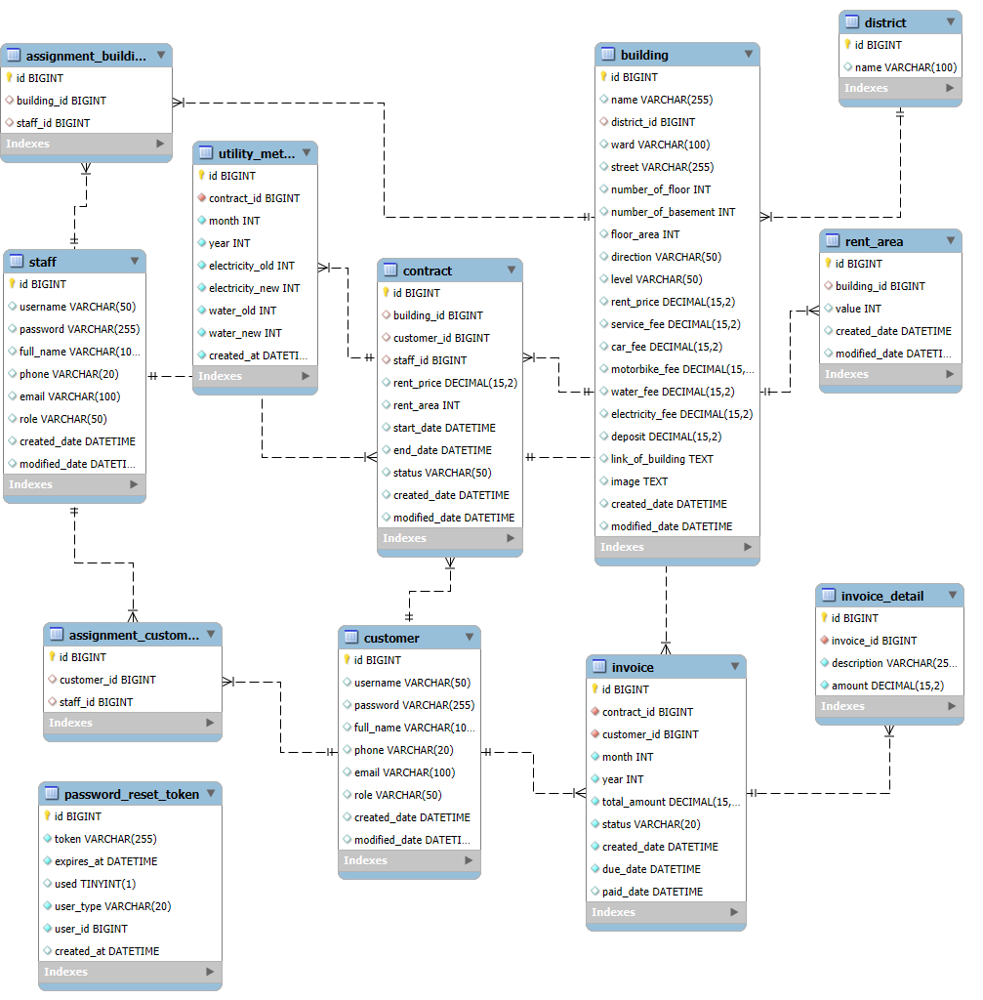

# MoonNest - Real Estate Management System

## Overview
A Spring Boot web application for managing buildings, customers, contracts,
invoices, and transactions with role-based access control.

## Technologies
- Java 21
- Spring Boot, Spring MVC, Spring Data JPA
- Spring Security, BCrypt
- Thymeleaf, Bootstrap, JQuery, Ajax
- MySQL

## System Roles
- Admin: Full system management (CRUD buildings, staffs, customers, contracts, invoices)
- Staff: Manage customers, contracts, invoices; track billing and transactions
- Customer: View contracts, invoices, transaction history; request profile updates
- Public: View building list without authentication

## Key Features
- Role-based authorization with Spring Security
- Secure password hashing using BCrypt
- Dynamic filtering and server-side pagination (JPA Specification + AJAX)
- RESTful APIs for asynchronous operations
- QR bank transfer payment flow

## Database Design


## How to Run
Read "guide.txt" file

cd D:\Documents\1.1.KLTN_PLAYWRIGHT\moonNest-main
$env:JAVA_HOME="C:\Program Files\Java\jdk-21.0.10"
.\mvnw.cmd spring-boot:run
```

## Access Info
- **Public Page**: http://localhost:8080/moonnest
- **Login**: http://localhost:8080/login
- **Default Credentials**: See [guide.txt](guide.txt)

## PROJECT IS FINISHED
